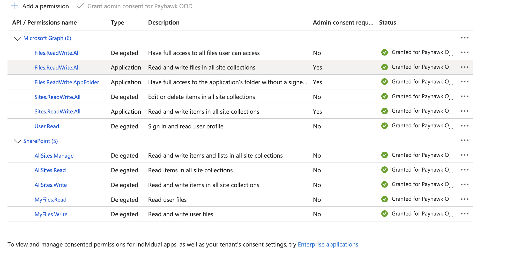

#### Summary

This is an example of generating a custom Document with Payhawk Per Diems, created with Azure function.

It is relying on Payhawk APIs and subscribing to a webhook.
The code can be modified to work with other types of expenses or be executed on a different expense event.

In this case NodeJS and Typescript is used and Microsoft Azure Function for hosting. Microsoft Office 365 and Graph API is used for file storage.
This Repo can be used as an example to use other technologies or storage providers (e.g blob storage).

#### How it works 

An expense is approved in Payhawk
Payhawk calls a Azure cloud function through a webhook
The cloud function uses the Payhawk API to get data related to the approved expense
The cloud function opens the template document in Sharepoint and replaces the predefined placeholders with data from the expense
The cloud function converts the resulting document in PDF format
The cloud function uses the Payhawk API to attach the PDF to the expense
All Payhawk users with access to the expense can now see the PDF document from within the Payhawk portal


#### Requirements

A Payhawk account
A Microsoft Azure Account 
Microsoft App Registration 
Sharepoint for Data Storage and Graph API access
Azure Plugin for VS code for deployment

For development - NodeJS and Azure CLI tools

#### How to setup and deploy

Set up the template document

Create a folder for the template file - example file is per-diem-templat-example.docx
Put the template in a dedicated folder.
The file contains Place holders with {} which will be replaced for each individual document

- Set up the cloud function:

Create the Azure Cloud Function v4

https://learn.microsoft.com/en-us/azure/azure-functions/functions-create-function-app-portal

Use Linux Deployment and node v20

- Setup App Registration

https://learn.microsoft.com/en-us/power-apps/developer/data-platform/walkthrough-register-app-azure-active-directory

Delegated access and might need administrator permission:


Generate a Client Secret

- Use Sharepoint Graph API to obtain IDs of Sharepoint Site, Template File ID and  Directory (https://learn.microsoft.com/en-us/graph/use-the-api)
To obtain the JWT token for authentication, you can run the code locally and debug or output the result of getAccessToken()

https://graph.microsoft.com/v1.0/drives/

https://graph.microsoft.com/v1.0/drives/{drive_id}/children

https://graph.microsoft.com/v1.0/drives/{drive_id}/items/{folder_id}/children

- Replace the values in the code

Taken from the Payhawk Portal:

Settings > Integrations > API > Create new API connection
```
const ACCOUNT_ID = ""; //Replace with account Id
const PAYHAWK_API_KEY = ""; //Replace with API Key
```

Taken from Azure Portal App Registration:

```
clientId: '', // Replace with your client ID
authority: 'https://login.microsoftonline.com/TENANT', // Replace with your tenant ID
clientSecret: '' // Replace with your client secret
```

Taken from Sharepoint via Graph API:
```
const driveId = ''; // Replace with Sharepoint Drive ID
const templateFileId = ''; // Replace with Template File ID in Sharepoint
const realFilesFolderId = ''; // Replace with SharePoint folder ID where the generated documents are stored in Sharepoint
```

Custom fields, as needed. Taken from Payhawk > Settings > Expense Fields
```
const PHLDR_TRIP_REASON = 'trip_reason_123456';                    // Replace with Custom Field id 
const PHLDR_TRANSPORT_TYPE = 'transport_type_123456';              // Replace with Custom Field id
// add more if needed 
```

Deploy the cloud function:

https://learn.microsoft.com/en-us/azure/azure-functions/functions-deployment-technologies?tabs=windows

Suggested method is via Visual Studio Code > Azure Core tools plugin

- After the function is deployed, register the Webhook subscription in Payhawk
https://developers.payhawk.com/#/Webhook%20Subscriptions/post_api_v3_accounts__accountId__webhooks

```
{
  "eventType": "{{Cloud_function_url}/api/payhawkWebhook",
  "callbackUrl": "expense.reviewed"
}
```
#### Running and testing

Run locally with:

npm run start

- To generate a document for an expense: 
Replace Id, accountId and expenseId

curl --location 'http://localhost:7071/api/payhawkWebhook' \
--header 'Content-Type: application/json' \
--data '{
  "id": "111111",
  "accountId": "account_id",
  "eventType": "expense.created",
  "payload": {
    "expenseId": "11"
  }
}'

- For Testing in the function directly in the cloud, use the URL directly.

curl --location '{{Cloud_function_url}/api/payhawkWebhook' \
--header 'Content-Type: application/json' \
--data '{
  "id": "111111",
  "accountId": "account_id",
  "eventType": "expense.created",
  "payload": {
    "expenseId": "11"
  }
}'

- Final testing should be to create a Per Diem in Payhawk and a PDF file should be automatically attached after ~10 seconds
If Per Diem policy is not setup, check 
https://help.payhawk.com/en/articles/6495170-configuring-the-per-diem-expense-type